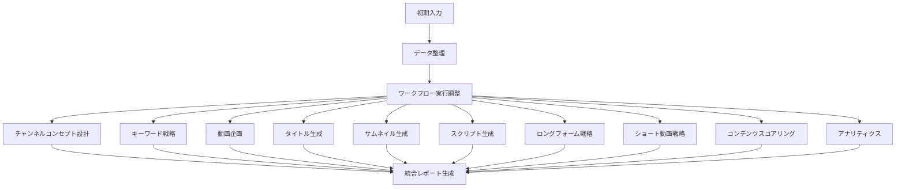

# YouTube統合マスターワークフロー ガイド

## 概要

`integratedYoutubeWorkflow` は、YouTube チャンネル運用に必要な全ての戦略的要素を一つの流れで実行する包括的なワークフローです。prompt.md に基づいた 13 種類のワークフローを順番に実行し、チャンネル立ち上げから運用まで必要な全ての成果物を生成します。

## ワークフローの全体像



## 入力パラメータ

### 必須項目

```typescript
{
  businessName: string;        // 事業者名
  performerName: string;       // 演者の名前
  youtubePurpose: string;      // YouTube運用の目的
  performerBackground: string; // 演者のバックボーンと経歴
}
```

### オプション項目

```typescript
{
  serviceUrl?: string;              // サービスURL
  targetAudience?: string;          // ターゲットオーディエンス
  contentGoals?: string[];          // コンテンツの目標
  competitorChannels?: string[];    // 競合チャンネル
  executeSteps?: {                  // 実行するステップの選択
    inputCollection: boolean;
    channelConcept: boolean;
    keywordResearch: boolean;
    videoPlanning: boolean;
    titleGeneration: boolean;
    thumbnailGeneration: boolean;
    scriptGeneration: boolean;
    longFormContent: boolean;
    shortsContent: boolean;
    contentScoring: boolean;
    analytics: boolean;
  }
}
```

## 実行される処理

### 1. 初期データ整理（Step 1）
- 入力データの検証と正規化
- 各ワークフローで使用する形式への変換
- 実行計画の確定

### 2. ワークフロー実行調整（Step 2）
各ワークフローを順番に実行：

#### 2.1 チャンネルコンセプト設計
- SEOキーワード調査（30個）
- ペルソナ設計（9→3ペルソナ）
- チャンネルコンセプト案生成（30案）

#### 2.2 キーワード戦略
- キーワードリサーチ
- 検索ボリューム分析
- 競合分析

#### 2.3 動画企画
- コンテンツ構造設計
- SEO最適化
- 競合差別化戦略

#### 2.4 タイトル生成
- ペルソナ別タイトル案
- CTR最適化
- SEO考慮

#### 2.5 サムネイル生成
- 視覚的インパクト設計
- テキスト要素最適化
- A/Bテスト案

#### 2.6 スクリプト生成
- 構造化スクリプト
- タイムスタンプ付き
- CTA組み込み

#### 2.7 ロングフォーム戦略
- ロードマップ型
- 会話型
- ストーリーテリング型

#### 2.8 ショート動画戦略
- トレンド分析
- フック設計
- 60秒スクリプト

### 3. 統合レポート生成（Step 3）
- エグゼクティブサマリー
- チャンネル戦略
- コンテンツプラン
- 実装ロードマップ
- 次のステップ

## 使用方法

### 基本的な使用

```typescript
import { integratedYoutubeWorkflow } from './workflows';

const result = await integratedYoutubeWorkflow.execute({
  businessName: 'ABC株式会社',
  performerName: '山田太郎',
  serviceUrl: 'https://example.com',
  youtubePurpose: 'BtoBサービスの認知拡大と見込み客獲得',
  performerBackground: '業界経験15年、〇〇の専門家',
  targetAudience: '中小企業の経営者・マーケティング担当者',
  contentGoals: ['教育', 'ソートリーダーシップ', 'リード獲得'],
});
```

### ヘルパー関数を使用

```typescript
// フル機能版
const result = await runIntegratedYoutubeStrategy({
  // ... 全パラメータ
});

// クイックスタート版（最小構成）
const result = await quickStartYoutubeChannel(
  'ビジネス名',
  '演者名',
  '運用目的'
);
```

### 特定ステップのみ実行

```typescript
const result = await integratedYoutubeWorkflow.execute({
  businessName: 'テスト',
  performerName: 'テスト',
  youtubePurpose: 'テスト',
  performerBackground: 'テスト',
  executeSteps: {
    inputCollection: false,
    channelConcept: true,    // これだけ実行
    keywordResearch: false,
    videoPlanning: false,
    titleGeneration: false,
    thumbnailGeneration: false,
    scriptGeneration: false,
    longFormContent: false,
    shortsContent: false,
    contentScoring: false,
    analytics: false,
  },
});
```

## 出力形式

### 成功時のレスポンス

```typescript
{
  success: true,
  message: "Workflow executed successfully",
  result: {
    integratedReport: {
      executiveSummary: string,      // 実行サマリー
      channelStrategy: {             // チャンネル戦略
        concept: {...},
        keywords: {...}
      },
      contentPlan: {                 // コンテンツ計画
        videoPlanning: {...},
        titles: {...},
        thumbnails: {...},
        scripts: {...}
      },
      implementationRoadmap: {       // 実装ロードマップ
        longForm: {...},
        shorts: {...}
      },
      nextSteps: string[],           // 次のアクション
      appendix: {                    // 付録
        rawResults: {...},
        metadata: {...}
      }
    },
    executionSummary: {              // 実行統計
      totalSteps: number,
      completedSteps: number,
      failedSteps: number,
      executionTime: string
    }
  }
}
```

## ベストプラクティス

### 1. 段階的な実行
最初は基本的なステップのみ実行し、結果を確認してから詳細なステップを実行：

```typescript
// Phase 1: 戦略立案
executeSteps: {
  channelConcept: true,
  keywordResearch: true,
  // 他は false
}

// Phase 2: コンテンツ設計
executeSteps: {
  videoPlanning: true,
  titleGeneration: true,
  thumbnailGeneration: true,
  // 他は false
}
```

### 2. エラーハンドリング
各ワークフローは独立してエラーハンドリングされるため、一部が失敗しても他は継続実行されます。

### 3. パフォーマンス考慮
- フル実行には 5-10 分程度かかる場合があります
- 必要なステップのみ選択して実行時間を短縮できます

## トラブルシューティング

### よくある問題

1. **APIキー未設定エラー**
   ```
   環境変数を確認: OPENAI_API_KEY, YOUTUBE_API_KEY
   ```

2. **タイムアウトエラー**
   ```
   実行ステップを減らすか、個別に実行
   ```

3. **メモリ不足**
   ```
   Node.js のメモリ制限を増やす: node --max-old-space-size=4096
   ```

## 関連ドキュメント

- [個別ワークフローガイド](./workflows-guide.md)
- [APIリファレンス](./api-reference.md)
- [プロンプトテンプレート](../prompt.md)

## サポート

問題が発生した場合は、以下をご確認ください：

1. エラーログの確認
2. 入力パラメータの検証
3. 環境変数の設定
4. ネットワーク接続